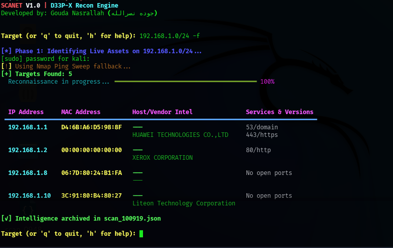

# SCANET Pro V1.0 🚀
**The Ultimate APT Intelligence Gathering & Reconnaissance Framework**

Developed by **Gouda Nasrallah (جوده نصرالله)**.



---

## 🇺🇸 English Version

### 🎯 Overview
**SCANET Pro** is a modern, elegant, and powerful network reconnaissance tool designed for security professionals and researchers. It combines speed, accuracy, and beautiful output to help you discover live hosts, services, and vulnerabilities efficiently.

### ✨ Key Features
- Hybrid Discovery Engine (Netdiscover + Nmap Ping Sweep)
- Fast Scan Mode (`-f`) – Top 100 ports
- Deep Vulnerability Scanning (`-v`) using Nmap NSE
- Infinite Loop Mode for continuous scanning
- Professional formatted output with Rich library
- Automatic structured JSON reporting

---

### 🛠️ Installation (Recommended Way)

```bash
# 1. Clone the repository
git clone https://github.com/GoudaWolfDev/SCANET.git
cd SCANET

# 2. Install system requirements
sudo apt update
sudo apt install nmap netdiscover -y

# 3. Create Python Virtual Environment (Strongly Recommended)
python3 -m venv venv

# 4. Activate the virtual environment
source venv/bin/activate

# 5. Install Python dependencies
pip install --upgrade pip
pip install -r requirements.txt
```

**💡 Why use a Virtual Environment?**
- Prevents library conflicts with other Kali tools.
- Resolves `externally-managed-environment` issues.
- Makes installation safer and cleaner.

---

### 🚀 How to Use

```bash
# Activate environment first (every new terminal)
source venv/bin/activate

# Show help
python scanet.py -h

# Basic Network Scan
sudo python scanet.py -t 192.168.1.0/24

# Fast Scan
sudo python scanet.py -t 192.168.1.0/24 -f

# Full Scan + Vulnerability Detection
sudo python scanet.py -t 192.168.1.0/24 -v

# Infinite Loop Mode
sudo python scanet.py -t 192.168.1.0/24 -m loop
```

> **Note**: `sudo` is required because Netdiscover and some Nmap features need root privileges.

---

## 🇸🇦 النسخة العربية

### 🎯 نظرة عامة
**SCANET Pro** أداة متطورة وأنيقة لجمع المعلومات الاستخباراتية وفحص الشبكات. تجمع بين السرعة والدقة والواجهة الجميلة، وهي مثالية للباحثين والمتخصصين في الأمن السيبراني.

### ✨ المميزات الرئيسية
- محرك اكتشاف هجين (Netdiscover + Nmap)
- وضع المسح السريع (`-f`)
- فحص الثغرات العميق (`-v`)
- وضع اللوب المستمر (Infinite Loop)
- واجهة مستخدم احترافية باستخدام Rich
- تصدير التقارير تلقائياً بصيغة JSON

---

### 🛠️ طريقة التثبيت (الطريقة الموصى بها)

```bash
# 1. استنساخ المشروع
git clone https://github.com/GoudaWolfDev/SCANET.git
cd SCANET

# 2. تثبيت الأدوات النظامية
sudo apt update
sudo apt install nmap netdiscover -y

# 3. إنشاء بيئة Python افتراضية (موصى به بشدة)
python3 -m venv venv

# 4. تفعيل البيئة
source venv/bin/activate

# 5. تثبيت المكتبات
pip install --upgrade pip
pip install -r requirements.txt
```

**💡 لماذا نستخدم Virtual Environment؟**
- يمنع تعارض المكتبات مع باقي أدوات Kali.
- يحل مشكلة `externally-managed-environment`.
- يجعل التثبيت أكثر أماناً ونظافة.

---

### 🚀 أمثلة الاستخدام

```bash
# تفعيل البيئة أولاً
source venv/bin/activate

# فحص الشبكة
sudo python scanet.py -t 192.168.1.0/24

# فحص سريع
sudo python scanet.py -t 192.168.1.0/24 -f

# فحص مع كشف الثغرات
sudo python scanet.py -t 192.168.1.0/24 -v

# وضع المسح المستمر
sudo python scanet.py -t 192.168.1.0/24 -m loop
```

---

## ⚖️ License
This project is licensed under a **Custom MIT License**.  
- اسم **SCANET** وتصميمه محمي.  
- ممنوع إعادة توزيع الأداة باسم أو شعار مختلف.  
راجع ملف [LICENSE](LICENSE) للتفاصيل.

## 👨‍💻 Developer
**Gouda Nasrallah (جوده نصرالله)**

---

> [!IMPORTANT]
> **تنبيه هام**: هذه الأداة مصممة للأغراض التعليمية والاختبات الأمنية المصرح بها فقط. المطور غير مسؤول عن أي استخدام غير قانوني.
